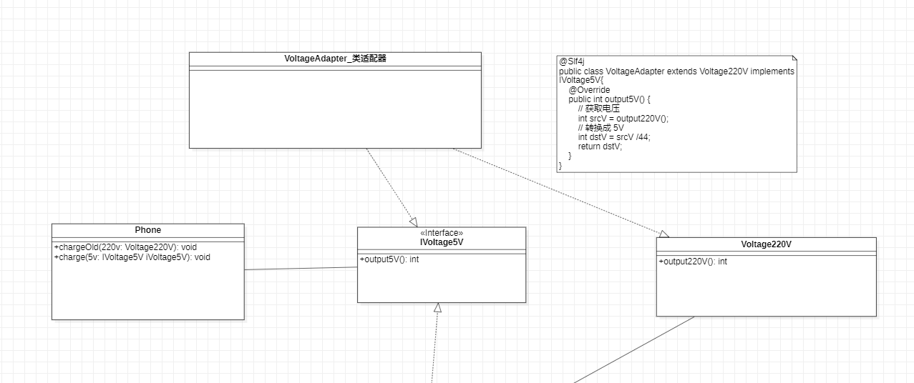
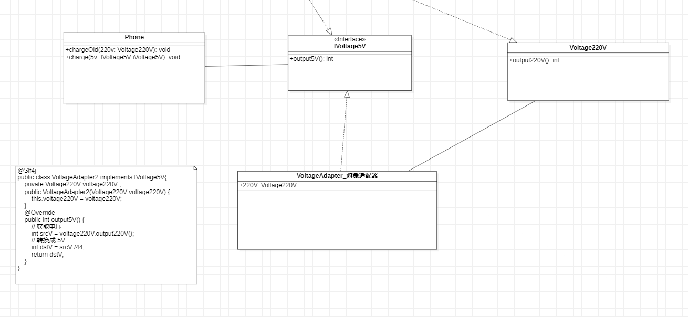
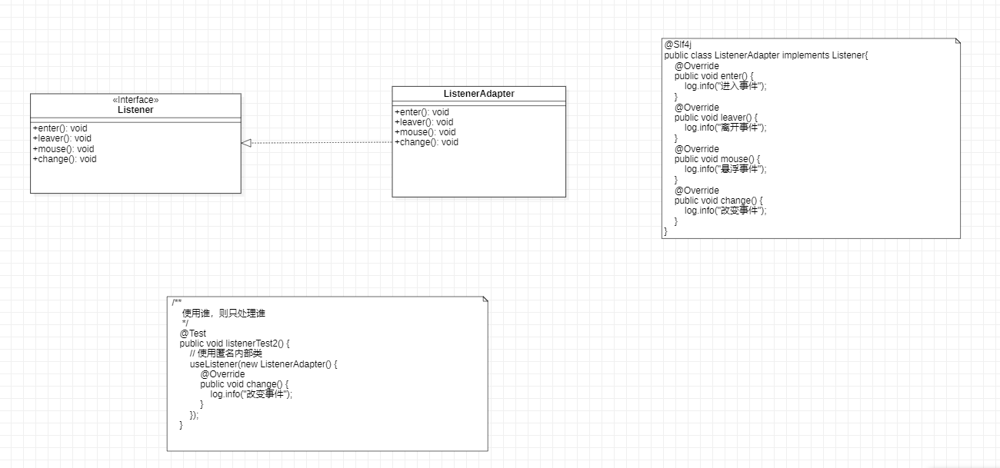

适配器模式

之前使用的是 220V 的电压进行充电的。

现在，要使用 5V 的进行充电。

~~~java
 public void chargeOld( Voltage220V voltage220V) {
        if (voltage220V.output220V() == 220) {
            log.info("电压是 220, 可以进行充电");
        }else {
            log.info("电压是: {}, 不能充电", voltage220V.output220V());
        }
    }
~~~

#  类适配器

1. Adapter extends 原有的  implements 新的接口

2. 在新的接口中， 调用原有的， 然后再进行转换

# 对象适配器

1. Adapter implement 新的接口， 通过构造方法传入原有的处理器。

#  接口适配器

一个类中有多个方法， 但只需要实现其中某几个，则可以使用 接口适配器。

Adapter implements 接口，  进行处理。

