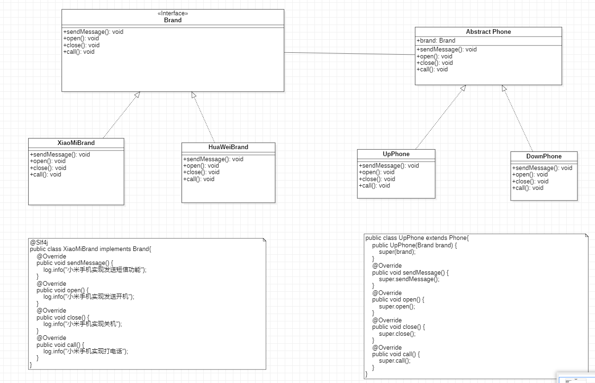

# 桥接模式

在很多情况下，会取代多层继承方案，避免类爆炸,极大的减少了类的个数。

会提高扩展性， 可以在任意两个维度进行扩展，不需要修改原有的系统。

但会增加系统的理解与设计难度。

适用的场景:
1. 当一个类存在两个独立变化的维护，并且这两个维护都需要进行扩展时。
2. 当一个系统不希望使用多继承和多层次继承导致类的个数急剧增加时。

如手机的品牌 和手机打开的方式 ( 上，下)是不同的信息。

注意，用大的范围在外面， 引用小的范围。

品牌 用接口，  实体 Phone 用 abstract class 抽象类进行实现

