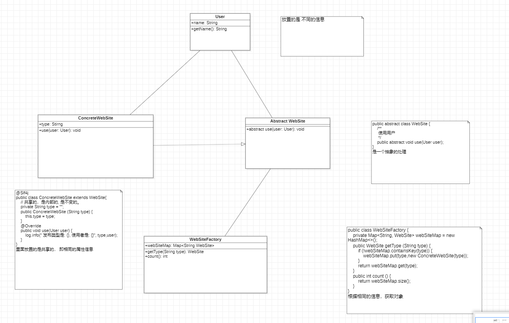

#  享元模式

通过共享的方式高效的支持大量细粒度的对象

主要解决: 在有大量对象时，有可能会造成内存溢出，
我们把其中共同的部分抽象出来，如果有相同的业务请求，直接返回在内存中已有的对象，避免重新创建

会减少对象的创建， 降低系统的内存，使效率提高。

我们抽取出一个对象的外部状态 (不能共享的) 和内部状态 (可以共享的)。
然后根据外部状态的决定是否创建内部状态对象。 内部状态对象是通过哈希表保存的。
当外部状态相同的时候，不再重复的创建内部状态对象，从而减少要创建对象的数量。

