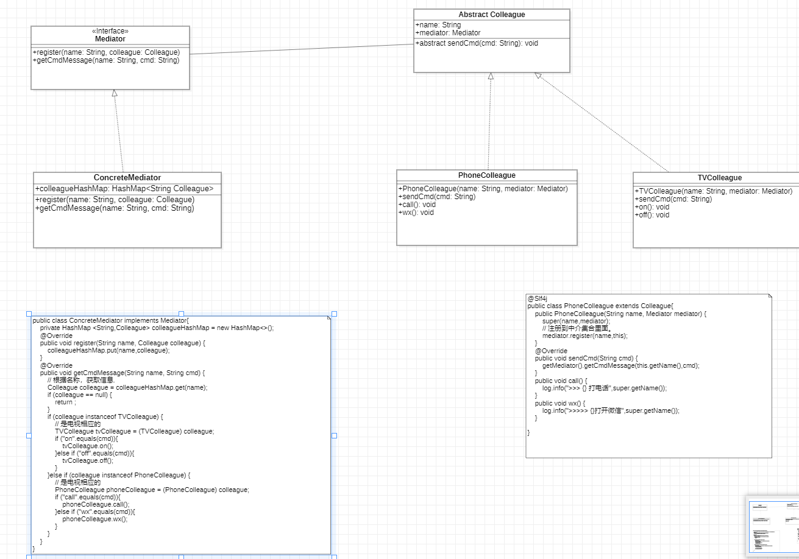

# 中介者模式

定义一个中介对象来封装一系列对象之间的交互，使原有对象之间的耦合松散，且可以独立地改变它们之间的交互。

又叫做 调停模式。   是迪米特法则的典型应用。

优点:
1. 降低了对象之间的耦合性， 使得对象易于独立地被复用。
2. 将对象间的一对多关联转变为一对一的关联，提高了系统的灵活性，使系统易于维护和扩展。

缺点:
当同事类太多时，中介者的职责将很大，会变得复杂而庞大，以至于难以维护。

