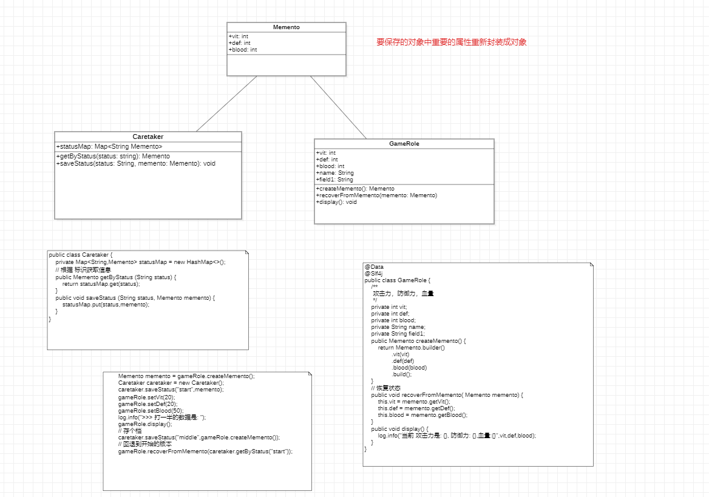

# 备忘录模式

定义: 在不破坏封装性的前堤下，捕获一个对象的内部状态，并在该对象之外保存这个状态，以便以后当需要能将该对象
恢复到原先保存的状态。 该模式又叫 快照模式

优点:
1. 提供了一种可以恢复状态的机制， 当用户需要时能够比较方便地将数据恢复到某个历史的状态。
2. 实现了内部状态的封装， 除了它的发起人之外，其他对象都不能访问这些状态信息。
3. 简化了发起人。 发起人不需要管理和保存其内部各个备份，所有状态信息都保存在备忘录中，并由管理者进行管理，
符合单一原则。

缺点:  资源消耗大。 如果状态信息特别多或者特别频繁， 将会占用比较大的内存资源。

