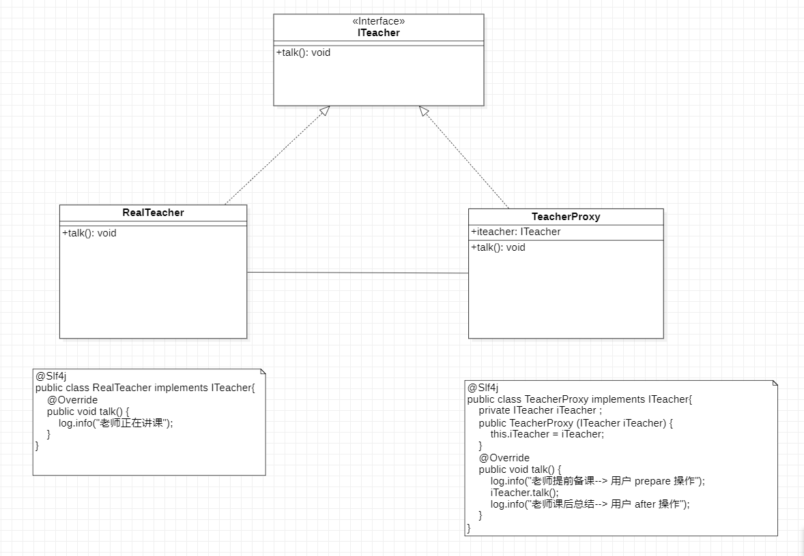

#  代理模式

可以进行隔离，
可以进行增加功能。

有 静态代理， 动态代理， 和 CGLIB 代理

#  静态代理

~~~java

@Slf4j
public class TeacherProxy implements ITeacher{
    private ITeacher iTeacher ;

    public TeacherProxy (ITeacher iTeacher) {
        this.iTeacher = iTeacher;
    }

    @Override
    public void talk() {
        log.info("老师提前备课--> 用户 prepare 操作");
        iTeacher.talk();
        log.info("老师课后总结--> 用户 after 操作");
    }

}

    @Test
    public void oneTest() {
        RealTeacher realTeacher = new RealTeacher();
        TeacherProxy teacherProxy = new TeacherProxy(realTeacher);
        teacherProxy.talk();
    }
~~~

#  动态代理

也叫 JDK 代理 
~~~java

@Slf4j
public class TeacherProxy2 {

    private Object target ;

    public TeacherProxy2 (Object target) {
        this.target = target;
    }

    /**
     获取动态代理
     */
    public Object getProxyInstance() {

        return Proxy.newProxyInstance(
                target.getClass().getClassLoader(),
                target.getClass().getInterfaces(),
                new InvocationHandler() {
                    @Override
                    public Object invoke(Object proxy, Method method, Object[] args) throws Throwable {
                        log.info("JDK代理开始");

                        Object returnVal = method.invoke(target, args);

                        log.info("JDK代理结束");
                        return returnVal;
                    }
                }
        );
    }

}

    @Test
    public void twoTest() {
        ITeacher2 teacher2 = new RealTeacher2();
        // 处理转换代理信息
        ITeacher2 target = (ITeacher2)(new TeacherProxy2(teacher2).getProxyInstance());
        // 进行处理
        target.hello("张三");
    }

    
~~~

# CGLIB 代理

动态字节码

~~~xml
 <dependency>
            <groupId>cglib</groupId>
            <artifactId>cglib</artifactId>
            <version>3.3.0</version>
        </dependency>
~~~

~~~java
@Slf4j
public class TeacherProxy3 implements MethodInterceptor {
    private Object target;
    public TeacherProxy3(Object target) {
        this.target = target;
    }

    public Object getProxyInstance () {
        // 创建工具类 Enhancer
        Enhancer enhancer = new Enhancer();
        // 设置父类
        enhancer.setSuperclass(target.getClass());
        // 设置回调函数, 主要是这个。
        enhancer.setCallback(this);
        // 创建子类对象，即代理对象
        return enhancer.create();
    }
    @Override
    public Object intercept(Object o, Method method, Object[] objects, MethodProxy methodProxy) throws Throwable {
        log.info("CGLIB 代理开始");

        Object returnVal = methodProxy.invoke(target, objects);

        log.info("CGLIB 代理结束");
        return returnVal;
    }

}

    @Test
    public void threeTest() {
        RealTeacher3 realTeacher3 = new RealTeacher3();
        // 处理转换代理信息
        RealTeacher3 target = (RealTeacher3)new TeacherProxy3(realTeacher3).getProxyInstance();
        // 进行处理
        target.hello("张三");
    }
~~~

可以使用 Hutool 代理

~~~java
@Test
    public void fourTest() {
        ITeacher2 teacher2 = new RealTeacher2();

        ITeacher2 proxy = ProxyUtil.proxy(teacher2, new SimpleAspect());

        proxy.hello("JDK动态代理");

        ITeacher2 proxy2 = ProxyFactory.createProxy(teacher2, new Aspect() {
            @Override
            public boolean before(Object target, Method method, Object[] args) {
                return false;
            }

            @Override
            public boolean after(Object target, Method method, Object[] args, Object returnVal) {
                return false;
            }

            @Override
            public boolean afterException(Object target, Method method, Object[] args, Throwable e) {
                return false;
            }
        });
        proxy2.hello("JDK 动态代理22");
    }

~~~

