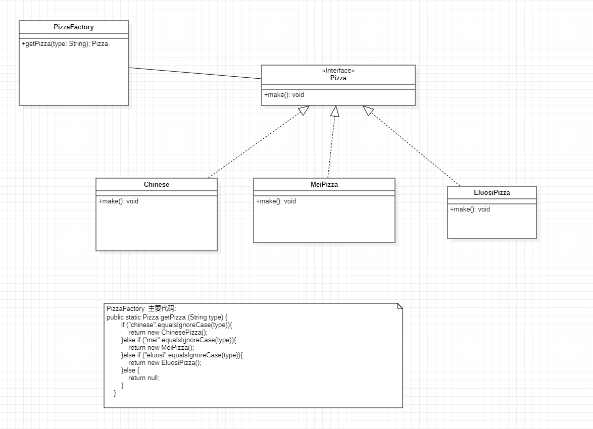

简单工厂模式

只获取一个对象  
~~~java

public static Pizza getPizza (String type) {
        if ("chinese".equalsIgnoreCase(type)){
            return new ChinesePizza();
        }else if ("mei".equalsIgnoreCase(type)){
            return new MeiPizza();
        }else if ("eluosi".equalsIgnoreCase(type)){
            return new EluosiPizza();
        }else {
            return null;
        }
    }

~~~

#  存在问题

有一个问题， 类的创建依赖于工厂类。
当新增加种类时， 需要对  getPizza(type: String) 方法进行修改，违背了开闭原因。

建议， 修改成 工厂方法模式

