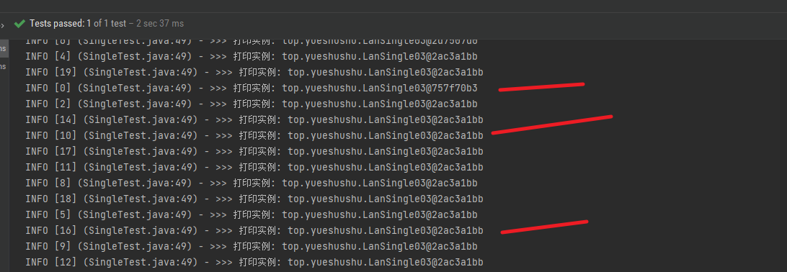
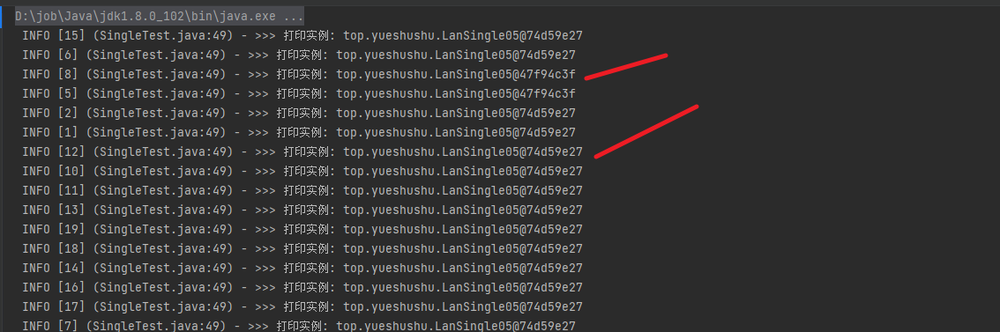
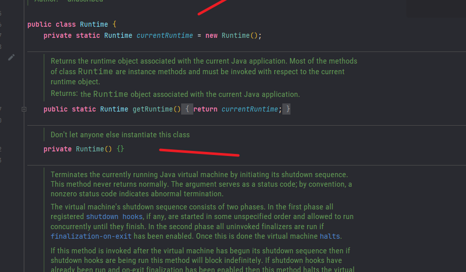

#  单例设计模式

所谓的单例设计模式，就是采用一定的方法保证在整个的软件系统中，对某个类只能存在一个对象实例，
并且该类只提供一个取得其对象实例的方法 (静态方法)

##  八种模式

1. 饿汉式 (静态常量)
2. 饿汉式 (静态代码块)
3. 懒汉式 (线程不安全)
4. 懒汉式 (线程安全， 同步方法)
5. 懒汉式 (线程安全，同步代码块)
6. 双重检查
7. 静态内部类 
8. 枚举

#  饿汉式  (静态常量)
##  代码

~~~java
public class Single01 {
    /**
    类的内部创建对象
     final static
     */
    private final static Single01 instance = new Single01();
    /**
    构建方法地私有化
     */
    private Single01() {

    }
    /**
      对外提供一个静态的公共方法
     */
    public static Single01 getInstance() {
        return instance;
    }
}
~~~

## 优缺点说明

优点:  写法比较简单，就是在类装载的时候就完成实例化。 避免了线程同步的问题。

缺点:  在类装载的时候就完成实例化，没有达到 Lazy Loading 懒加载的效果。 
如果从始至终从未使用过这个变量，则会造成内存的浪费。

这种方式 基于 classloader 机制避免了多线程同步的问题，不过 instance 在类装载时就进行实例化，
在单例模式中大多数都是调用 getInstance() 方法，但是导致类装载的原因有多种，因此不能确定有其他的方式 (其他的静态方法)
导致类装载， 这时候初始化 instance 就没有达到 lazy loading 的效果。

结论: 这种单例模式可用，但可能会造成内存浪费。

# 饿汉式 (静态代码块)

##  代码

~~~java
public class Single02 {
    private static Single02 instance ;
    static {
        instance = new Single02();
    }
    private Single02 (){

    }

    public static Single02 getInstance() {
        return instance;
    }
}
~~~

###  优缺点说明

1) 这种方式和上面的方式其实类似，只不过将类实例化的过程放在了静态代码块中，
也是在类装载的时候，就执 行静态代码块中的代码，初始化类的实例。优缺点和上面是一样的。
2) 结论：这种单例模式可用，但是可能造成内存浪费

# 懒汉式 (线程不安全)

##  代码
~~~java
public class LanSingle03 {
    private static LanSingle03 instance;

    private LanSingle03 (){

    }

    public static LanSingle03 getInstance() {
        if (instance == null) {
            instance = new LanSingle03();
        }
        return instance;
    }
}
~~~

## 优缺点说明:

1. 起到了 Lazy Loading 的效果，但是只能在单线程下使用。
2. 如果在多线程下，一个线程进行了 if 判断语句，还没有来得及往下执行，另一个线程也通过了这个判断语句， 这时便会产生多个实例。
所以在多线程环境下不可以使用这种方式

~~~java
 public static LanSingle03 getInstance() {
        if (instance == null) {
            // 如休眠几秒时会放大效果
            instance = new LanSingle03();
        }
        return instance;
 }
~~~

演示:

~~~java

  @Test
    public void threadTest() throws Exception{
        for( int i = 0; i< 20; i++) {
            new Thread(()->{
                log.info(">>> 打印实例: {}", LanSingle03.getInstance());
            },i+"").start();
        }
        TimeUnit.SECONDS.sleep(2);
    }
    
~~~

结论: 在实际开发中，不要使用这种方式

# 懒汉式 (线程安全，同步方法)

##  代码

~~~java

public class LanSingle04 {
    private static LanSingle04 instance;

    private LanSingle04(){

    }

    public synchronized static LanSingle04 getInstance() {
        if (instance == null) {
            instance = new LanSingle04();
        }
        return instance;
    }
}

~~~

## 优缺点
1. 解决了线程安全问题
2. 效率太低了， 每个线程在想获得类的实例的时候，执行 getInstance() 方法都要进行同步。
而其实这个方法只执行一次实例化代码就够了， 后面的想获得该类的实例的时候，直接 return 就行了。
方法进行同步，效率太低。
3. 结论: 在实际开发中，不推荐使用这种方式

# 懒汉式 (线程安全,同步代码块)

##  代码

~~~java

public class LanSingle05 {
    private static LanSingle05 instance;

    private LanSingle05(){

    }

    public static LanSingle05 getInstance() {
        if (instance == null) {
            synchronized (LanSingle05.class){
                instance = new LanSingle05();
            }
        }
        return instance;
    }
}
~~~

## 优缺点
1. 有线程同步问题

~~~java
public static LanSingle05 getInstance() {
        if (instance == null) {
            synchronized (LanSingle05.class){
                // 休眠时会放大
                instance = new LanSingle05();
            }
        }
        return instance;
    }

~~~

结论: 在实际开发中，不推荐使用这种方式

# 双重检查
##  代码
~~~java
public class CheckSingle06 {
    private static CheckSingle06 instance;

    private CheckSingle06(){

    }

    public static CheckSingle06 getInstance() {
        if (instance == null) {
            synchronized (CheckSingle06.class){
               if (instance == null) {
                   instance = new CheckSingle06();
               }
            }
        }
        return instance;
    }
}
~~~

##  优缺点

1. Double-Check 概念是多线程开发中常使用到的， 进行了两次 if( instance == null) 检查，这样就可以保证线程安全了。
2. 实例化代码只用了一次，后面再访问时， 判断 if (instance ==null) 直接 return 实例化对象 ，也避免了反复进行方法同步。
3. 线程安全的: 会延迟加载， 效率较高。
4. 结论: 在实际开发中， 推荐使用这种单例设计模式

# 静态内部类

##  代码

~~~java

public class InnerSingle07 {
    private InnerSingle07(){

    }

    private static class InnerClass {
        private static final InnerSingle07 INSTANCE = new InnerSingle07();
    }

    public static InnerSingle07 getInstance() {
       return InnerClass.INSTANCE;
    }
}
~~~

## 优缺点
1. 采用了类装载的机制来保证初始化实例只有一个线程
2. 静态内部类方式在 InnerSingle07 类被装载时并不会立即实例化， 而是在需要实例化时，调用 getInstance 方法，
才会装载 InnerClass 类，从而完成 InnerSingle07 的实例化。
3. 类的静态属性只会在第一次加载类的时候初始化， 所以在这里， JVM 帮助我们保证了线程的安全性，
在类进行初始化时，别的线程是无法进入的。
4. 优点: 避免了线程不安全，利用静态内部类特点实现了延迟加载，效率高。
5. 结论: 推荐使用

#  枚举

##  代码
~~~java
public enum EnumSingle08 {
   INSTANCE("1");

    private String name;

    EnumSingle08(String name) {
        this.name = name;
    }

    public String getName() {
        return name;
    }
}

~~~

###  优缺点

1. 这借助 JDK1.5 中添加的枚举来实现单例模式。不仅能避免多线程同步问题，而且还能防止反序列化重新创建 新的对象。
2. 这种方式是 Effective Java 作者 Josh Bloch 提倡的方式 
3. 结论：推荐使用

#  单例模式

是饿汉式第一种

1. 单例模式保证了 系统内存中该类只存在一个对象，节省了系统资源，对于一些需要频繁创建销毁的对象，使 用单例模式可以提高系统性能
2) 当想实例化一个单例类的时候，必须要记住使用相应的获取对象的方法，而不是使用 new
3) 单例模式使用的场景：需要频繁的进行创建和销毁的对象、创建对象时耗时过多或耗费资源过多(即：重量级 对象)，
但又经常用到的对象、工具类对象、频繁访问数据库或文件的对象(比如数据源、session 工厂等)
