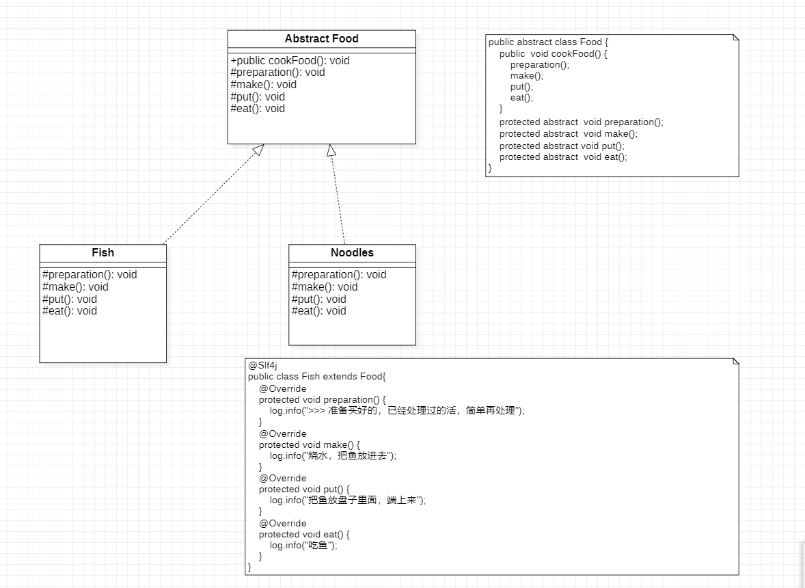

# 模板模式

定义一个操作中算法的骨架，而将一些步骤延迟到子类中， 模板方法使得子类可以不改变算法的结构即可重定义该算法的某些特定步骤。

通俗点讲: 完成一件事情，有固定的数个步骤， 但是每个步骤根据对象的不同，而实现细节不同，
就可以在父类中定义一个完成该事情的总方法，按照完成事件需要的步骤云调用其每个步骤的实现方法。
每个步骤的具体实现，由子类完成。

##  优点

1. 具体细节步骤实现在子类中，子类定义详细处理算法 是不会改变算法整体结构的。
2. 代码复用的基本技术，在数据库设计中特别重要
3. 存在一种反向的控制结构， 通过一个低头调用其子类 操作，通过子类对父类进行扩展增加新的行为，
符合开闭原则。

缺点:
每个不同的实现都需要定义一个子类，会导致类的个数增加，系统会变得庞大。

