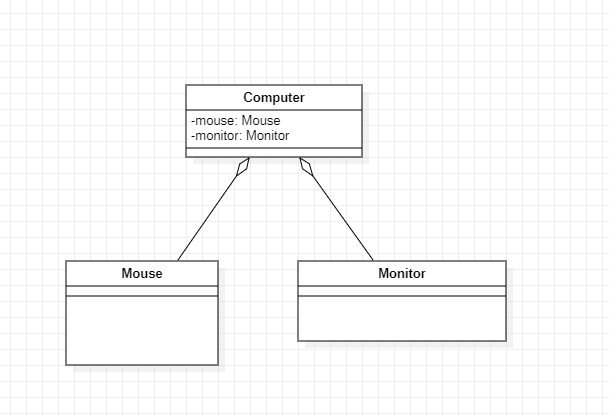

# UML 类图

UML (Unified modeling language) 统一建模语言，是一种用于软件系统分析和设计的语言工具，
它用于帮助软件开发人员进行思考和记录思路的结果。

UML 本身是一套符号的支付宝， 就像数学符号和化学符号一样，这些符号用于描述软件模型中的各个元素和他们之间的关系，
比如， 类，接口，实现，泛化，依赖，组合，聚合等。

#  依赖关系  Dependence

~~~java
public class PersonServiceBean {
    private PersonDao personDao;

    public void save(Person person) {

    }

    public IDCard getIdCard(Integer personId){
        return new IDCard();
    }

    public Dept getDept() {
        Dept dept = new Dept();
        return dept;
    }
}
~~~

依赖，是只要两个类有联系， 成员变量，方法参数， 方法返回值， 方法内变量(不遵守 迪米特法则时)
都属于 依赖

依赖是:  虚线的箭头

#  泛化关系   Generalization
泛化是一种特殊的依赖， 是 继承 extends 关系
如果 A extends B, 那么就说 A 和 B 之间存在泛化关系。

~~~java
@Data
public class Student extends Person{

}
~~~

#  实现关系 Implementation
实现， 如果 A 类 implements B 接口， 那么就是依赖

~~~java
public interface PersonService {
    
}
public class PersonServiceBean  implements PersonService{

}
~~~

# 关联关系   Association
关联关系实际上就是类与类之间的联系，是依赖关系的特例。
相比于依赖关系， 它具有导航性:  有双向关系 或者单向关系
关系有多重性:  1 (有且只有1个)  0 (0个或者多个)  0,1 (0个或者1个)  n...m (n到m个都可以)  m...* (至少m个)

~~~java
@Data
public class IDCard {
    private Person person;
}

@Data
public class Person {
    private IDCard idCard;
}

~~~

#  聚合关系   Aggregation
聚合关系 表示的是整体和部分的关系， 整体与部分可以分开。
聚合关系是关联关系的特例， 所以他具有关联的导航性和多重性。

~~~java
public class Computer {
    private Mouse mouse;
    private Monitor monitor;

    public void setMouse(Mouse mouse) {
        this.mouse = mouse;
    }

    public void setMonitor(Monitor monitor) {
        this.monitor = monitor;
    }
}
~~~

# 组合关系    Composition

组合关系， 也是 关联关系的一种， 也是整体与部分的关系，但整体与部分不可以分开。

如:  人 和头

~~~java
@Data
public class Person {
   private IDCard idCard;
   
   // 不可以分割，在成员变量时，直接构造。
   private Head head = new Head();
}

~~~

#  关系层次是:

